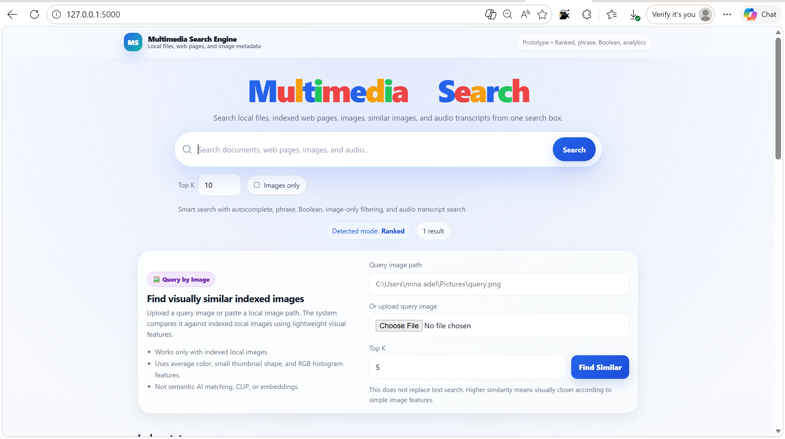

# Multimedia Search Engine

<p align="center">
  
</p>

<p align="center">
  <b>A modular Python search engine for documents, web pages, images, similar-image search, and audio transcript search.</b>
</p>

<p align="center">
  
  
  
  
  
</p>

---

## Project Overview

**Multimedia Search Engine** is a modular Information Retrieval project built with Python and Flask.

The project started as a classic text-based search engine, then evolved into a multimedia retrieval system that can index and search across:

| Source Type | Supported |
|---|---|
| Local documents | Yes |
| Web pages | Yes |
| Images | Yes |
| Similar images | Yes |
| Audio / voice notes | Yes |
| Audio transcripts | Yes |

The system uses a shared indexing and retrieval pipeline. Documents, images, web pages, and audio transcripts are converted into searchable text, then indexed using classic Information Retrieval techniques.

This project demonstrates core IR concepts such as preprocessing, inverted indexing, Boolean retrieval, phrase retrieval, ranked retrieval, positional postings, tf-idf scoring, and multimedia search extensions.

---

## What This Project Can Do

### 1. Index Local Files

The engine can scan a local folder recursively and index supported files.

Supported document formats:

| Type | Extensions |
|---|---|
| Text | `.txt` |
| PDF | `.pdf` |
| Word | `.docx` |
| CSV | `.csv` |
| JSON | `.json` |
| Markdown | `.md` |

Supported image formats:

| Type | Extensions |
|---|---|
| Images | `.jpg`, `.jpeg`, `.png`, `.webp` |

Supported audio/video-with-audio formats:

| Type | Extensions |
|---|---|
| Audio | `.mp3`, `.wav`, `.m4a`, `.ogg`, `.webm`, `.mp4`, `.mpeg`, `.mpga`, `.flac` |

---

### 2. Search with Ranked Retrieval

Users can type normal free-text queries.

Example:

```text
network security
project deadline
python indexing
dog in park
